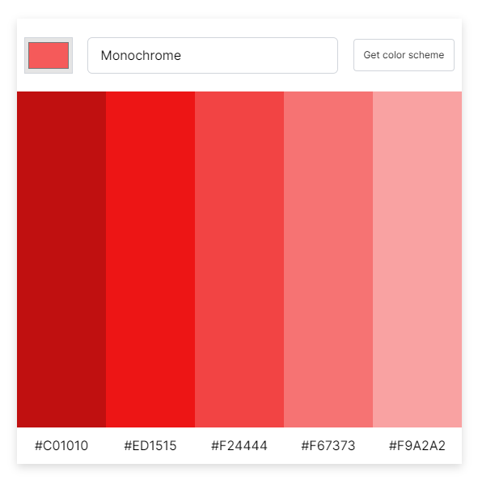

Here's a beautiful, creative, and attractive README for your **Color Scheme Generator** project:

---

# 🎨 Color Scheme Generator

Welcome to the **Color Scheme Generator**! This project allows you to instantly generate stunning color palettes that you can use in your design projects. With a click of a button, the app fetches vibrant color schemes using a powerful Color API and presents them to you in a visually engaging layout.

## 🌟 Features

- **Instant Color Palette Generation**: Quickly generate color schemes with a single click.
- **Color API Integration**: Fetches data directly from a color API for fresh, beautiful palettes.
- **User-Friendly Interface**: Minimalistic design with seamless UX for easy navigation.
- **Copy Color Codes**: Easily copy HEX codes for each color to use in your own projects.
- **Responsive Design**: Fully functional on desktop and mobile devices.

## 🎯 Purpose

Whether you're a designer, developer, or just someone who loves exploring different color combinations, this tool will help you discover the perfect color palette for your project in seconds.

## 💻 Technologies Used

- **HTML**: Structuring the webpage for optimal user experience.
- **CSS**: Styling the interface with modern, clean aesthetics.
- **JavaScript**: Powering the app's logic and dynamic behavior.
- **Color API**: Fetches random, harmonious color schemes from an external API.

## 🚀 How It Works

1. **Click the Button**: Press the "Generate Color Scheme" button to receive a fresh set of colors.
2. **View the Palette**: Instantly, five harmonious colors will appear on the screen.
3. **Copy & Use**: Click on any color to copy its HEX code and use it in your project.

## 🖼️ Screenshots

  
_A sleek and intuitive interface to find your next color inspiration._

## 📂 Project Setup

1. Clone the repository:
   ```bash
   git clone https://github.com/yourusername/color-scheme-generator.git
   ```

2. Navigate into the project folder:
   ```bash
   cd color-scheme-generator
   ```

3. Open `index.html` in your browser to run the app:
   ```bash
   open index.html
   ```

## 📌 Future Enhancements

- **Color Scheme Saving**: Save favorite palettes to local storage.
- **Custom Palette Input**: Allow users to input their own base colors to generate matching palettes.
- **Accessibility Features**: Add options for colorblind users to generate suitable palettes.

## 👏 Contributions

We welcome contributions from the community! Feel free to open issues, suggest new features, or submit pull requests.

## 📧 Contact

Feel free to reach out with any questions or feedback!  
**Project Maintainer**: Saket Prasad  
**Email**: saket98838@gmail.com

---

Thank you for checking out the **Color Scheme Generator**. Get inspired and start designing today! 🌈

